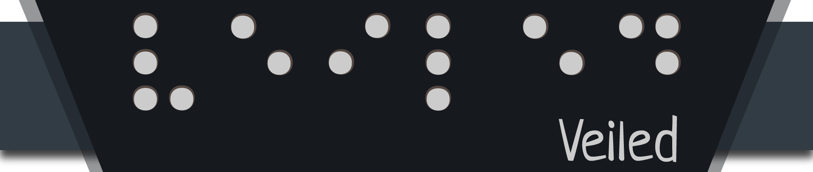

**Emiliagos Aarabels (EAa) [2º GDV]**

- Emile de Kadt ([edekadt@ucm.es](mailto:edekadt@ucm.es))
- Aarón Nauzet Moreno Sosa ([aarmor01@ucm.es](mailto:aarmor01@ucm.es))
- Abel Moro Paje ([abelmoro@ucm.es](mailto:abelmoro@ucm.es))
- Iago Quintas Diz ([iquintas@ucm.es](mailto:iquintas@ucm.es))

[ENLACE A PIVOTAL](https://www.pivotaltracker.com/n/projects/2467983)

_**Veiled**_ es un juego de exploración en el que el jugador controla a María en su búsqueda por alcanzar la iluminación definitiva. Durante la exploración, la protagonista llevará una venda puesta, que no le permitirá ver de manera correcta el mundo que le rodea. Así, a lo largo de los eventos, María obtendrá fe, lo que le podrá permitir avanzar en los niveles (y por tanto en su búsqueda). Además, la cordura de la protagonista obligará al jugador a manejar correctamente el uso/desuso de la venda.

### Movimiento

La protagonista se moverá en **8 direcciones**, siendo la velocidad de movimiento un poco más rápida que el resto de NPCs.

### Barra de cordura

El personaje tendrá un medidor que representa su **cordura**. Funcionará a modo de barra de vida, pues al agotarse toda la barra, el jugador se verá obligado a hacer un evento, en el cual, se le mostrrán varias opciones con distintos requisitos para salvarse y continuar el nivel.

El decremento de la barra es constante hasta que llega a un umbral definido. Por debajo de este, las pérdidas son logarítmicas, de forma que cuando está baja las pérdidas son reducidas.

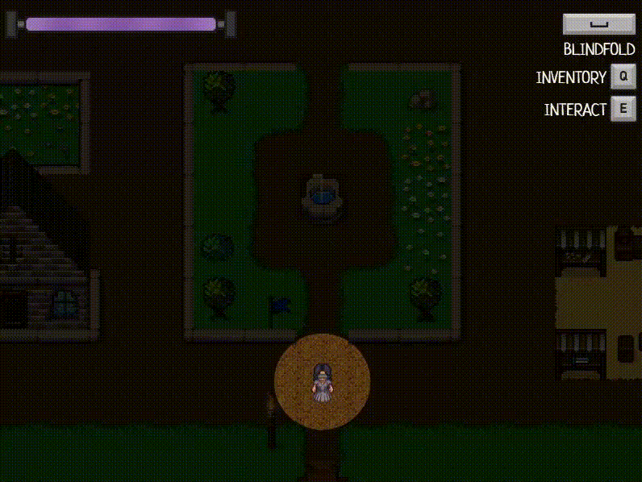

### Percepción

#### Venda

El jugador tendrá puesta constantemente una **venda** , que le impide ver el mapa salvo un radio pequeño alrededor del personaje (el rango de sonido de sus pasos). Aun así, es posible quitarse la venda, lo que permitirá ver mayor parte del mapa, pero hará que disminuya la barra de cordura hasta que vuelva a ponérsela (y no incrementa al volver a ponérsela).

#### Estímulos

A lo largo del mapa, habrá una serie de **estímulos sensoriales** (sonido, olfato) que ayudan a localizar a los npc (pasos) y también muestran objetivos como en algunos eventos (olor de un árbol).

### Fe

La **fe** sirve como principal medidor de progreso del juego y se indicara mediante un barra durante el nivel (estilo barra True Jedi del Lego Star Wars).

Al finalizar el nivel, se indicará la fe obtenida y cuántos eventos se han completado mediante una pantalla de información.

### Eventos

Mediante los npcs y algunas situaciones concretas podremos acceder a una serie de **eventos de texto** que presentarán un problema o una historia al jugador y podrán ser resueltos siguiendo su árbol de diálogos correspondiente.

- **Principales:** Serán aquellos que avanzarán la trama principal de juego. Estos serán activados por los diferentes NPCs del nivel (hermano, marido, etc), y serán recordados por la silueta, un ente que aparece solo al tener la venda puesta, y que recordará al jugador que evento debe hacer. Esta línea de eventos concluirá en un gran incremento de fe y desbloqueará el final del juego.

- **Secundarios:** sirven para expandir la historia, obtener recompensas (cordura, fe, consumibles).

- **Trigger:** se lanzan al cumplir ciertos objetivos, por ejemplo, agotarse la barra de cordura (evento de "muerte").

Algunos de estos eventos pueden tener requisitos para ser iniciados y completados, como haber progresado lo suficiente con otro npc o estar en posesión del objeto clave correspondiente.

### NPCs

Los niveles contarán con varios NPCs interactuables, que recorren un camino preestablecido, y que al interactuar con ellos activarán algún tipo de evento, ya sea principal, secundario o simplemente diálogo.

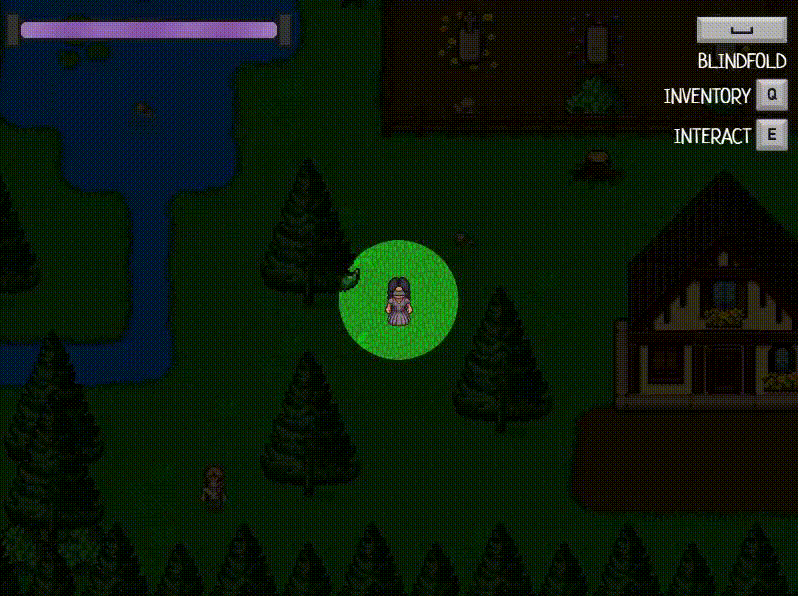

#### Silueta

La silueta es un npc especial que representa el espíritu de tu difunto padre, esta solo aparece cuando María tiene la venda puesta y si se tiene cierto nivel de fe. Su función es la de servir como guía para hacer las misiones principales.  

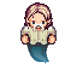

### Objetos

A lo largo de la partida se podrán conseguir **objetos** , que afecten a las características del jugador. Estos se podrán obtener siendo encontrados en el mapa o bien como recompensa tras un evento. Cada uno tendrá una descripción que indicará que hace cada uno. Se dividen en:

- **Claves** : Necesarios para avanzar en uno de los posibles eventos. (Ejemplo: encontrar la comida que le puedes dar al niño cerca del molino).
- **Consumibles** : De un solo uso, permiten recuperar cordura o tener efectos beneficiosos temporales. (Ejemplo: poción/medicina que recupera una poco de cordura).

### Objetivo y conflictos

El **objetivo** del juego es ir completando los eventos principales del nivel (indicados por la silueta), para así poder ir avanzando en los distintos niveles y llegar a alcanzar la iluminación

Explorar con la venda puesta será más difícil, pero no drenará la cordura. Algunos objetos o pistas serán imposibles de encontrar con la venda puesta. Sin embargo, explorar sin la venda será mucho más rápido y eficiente, pero más arriesgado, ya que perderás cordura.

### Comportamiento esperado

La búsqueda de pistas y objetos que te ayuden implica más exploración, la cual puede ser realizada con o sin venda.

Cuando el jugador entre en un nivel, primero empezará a explorar un poco, probablemente encontrando y completando por el camino algún objetivo secundario. En algún momento encontrará la silueta del nivel, y ocurrirá una de dos cosas: o el jugador tendrá suficiente cordura para emprender el objetivo, en cual caso lo hará, o no la tendrá en cual caso se acordará de la posición de la silueta mientras vuelve a buscar incrementos de cordura.

Cuando complete el objetivo principal, el jugador puede quedarse por el nivel, completando algún objetivo secundario que quiera o necesite (si encuentra y completa muy rápido el objetivo principal, es posible que no tenga suficiente fe para progresar al siguiente nivel).

El juego tiene una dificultad baja y una longitud relativamente corta. Se espera que cualquier jugador pueda completar el juego en menos de 1 hora.

### Niveles

- En el **Preludio** el jugador se encuentra en la habitación del padre de María, ya en su lecho de muerte. Ahí, será guiado por una serie de instrucciones para que se adapte a los controles mientras avanza una "pequeña" historia antes de ver al padre morir.

- En el **Pueblo** María continuará explorando su pueblo natal interactuando con personajes de su infancia y otros nuevos conocidos. El nivel estará compuesto por una zona residencial y algunos edificios más alejados como la casa del doctor o el aserradero del leñador.

- Durante el **Epílogo** y tras completar la línea de eventos principal en el pueblo, el jugador podrá desbloquear la posibilidad de hablar con su abuela que le entregara una carta de su padre. El video final del juego donde se ve el contenido de la carta se puede consultar en este mismo [repositorio](https://github.com/SrVonPsikerfy/Veiled/blob/main/assets/media/ending.mp4).

### Historia

María busca recuperar su fe en la misericordia de Dios, y en el proceso aprenderá a aceptar su nuevo don y a ver la belleza del mundo por un nuevo medio.

Tras haber recuperado su vista justo en el momento de la muerte de su padre, María decide vendarse los ojos para volver a la oscuridad. Se encierra en si misma, aferrándose a las tinieblas y a la memoria de su padre. En su estancia en su pueblo natal, conoce a varias personas que le abren los ojos, literal y metafóricamente, a las nuevas posibilidades que tiene por delante.

Cuando su estado de ánimo ha sido restaurado, es capaz de conciliar su pena y dejar aceptar su nueva circunstancia.

### Eventos

Cada NPC cuenta con algún tipo de evento, en el preludio el padre tiene el evento inicial y durante el nivel del pueblo 12 NPCs cuentan con sus propios eventos, en algunos casos conectados entre ellos.

Ejemplo de un evento de texto.

### NPCs

#### PRELUDIO (Tutorial)

| Sprite | Nombre | Evento |
|--------|--------|--------|
| 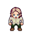| Padre | Sirve de tutorial principal e introducción a la historia |

#### PUEBLO

| Sprite | Nombre | Evento |
|--------|--------|--------|
| 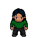| Hermano | Progresa la línea principal |
| 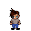| Niño | Te cambia una flor por un poco de comida |
| 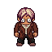| Doctor | Progresa la línea principal |
| 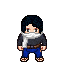| Ayudante | Le puedes ayudar a encontrar sus gafas |
| 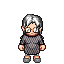| Abuela | Progresa la línea principal |
| 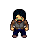| Anciano | Recuerda mecánicas básicas al principio del nivel y apunta al jugador a distintas partes del pueblo |
| 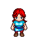| Extranjera | Te da una bolsa de monedas a cambio de ayuda |
| 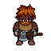| Leñador | Te manda a buscar un árbol enfermo |
| 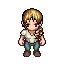| Pintora | Puedes opinar sobre su obra |
| 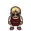| Vendedor | Intercambia objetos consumibles por bolsas de monedas |
| 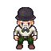| Tavernero | Te manda a buscar un bastón para poder avanzar la trama principal |
| 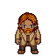| Vagabundo | Parte del evento del doctor |

### Items

- **PRELUDIO (Tutorial)**

| Sprite | Nombre | Utilidad |
|--------|--------|--------|
| | Foto | Permite continuar el tutorial del preludio |
| | Colgante | Aumenta la fe (+60) |

- **CLAVE**

| Sprite | Nombre | Utilidad |
|--------|--------|--------|
| | Figura tallada | Te permite sobrevivir al evento de muerte |
| 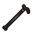| Baston | Permite terminar el evento del vagabundo |
| | Botella | Permite terminar el evento de anciano |
| | Cubo vacío | Permite iniciar el evento del pozo |
| | Cubo con agua | Permite terminar el evento del pozo |
| | Flor | Permite terminar el evento del cementerio |
| | Comida | Permite terminar el evento del niño |
| | Gafas | Necesario para completar el evento del ayudante  |
| | Boceto | Utilizado durante el evento de la pintora |
| 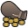| Bolsa con monedas | Permite comprar un consumible al vendedor de la plaza |

- **CONSUMIBLES**

| Sprite | Nombre | Utilidad |
|--------|--------|--------|
| | Poción | Recupera cordura (+30) |
| 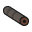| Caleidoscopio | Reduce el gasto de cordura con la venda quitada (50%) |
| | Estampita | Aumenta la fe (+10) |
| | Bendición | Aumenta bastante la fe (+30) |
| | Venda de tela | Aumenta la cordura máxima (+30) |
| | Fuego sagrado | Tu cordura maxima disminuye (-30), pero aumenta bastante tu fe |
| | Láudano | Menos probabiblidad de morir durante la opción RNG del evento de muerte |

El juego usa una estética minimalista, con pixel art para el mapa y los personajes y gráficos de vectores para el resto (interfaz, iconos, etc), perspectiva ortogonal y una paleta apagada.

Tileset "Interior 16x" en [OpenGameArt.org](https://opengameart.org/content/interior-tileset-16x16) creado por Bonsaiheldin para el nivel del preludio.

Tileset "Slates" en [OpenGameArt.org](https://opengameart.org/content/slates-32x32px-orthogonal-tileset-by-ivan-voirol) creado por Ivan Voirol para el nivel del pueblo.

Personajes creados con [Character Generator](https://github.com/sanderfrenken/Universal-LPC-Spritesheet-Character-Generator).

Resto del arte creado por nosotros, puedes consultar los archivos fuente en este mismo [repositorio](https://github.com/SrVonPsikerfy/Veiled/tree/main/assets/media/source).

Música Menu Principal: In The Light - David Renda

Para jugar se necesitará **teclado** y **ratón**, siendo el movimiento controlado con las teclas WASD, el uso de la venda será controlado con Espacio, la E servirá para interactuar con los elementos del entorno, Q para abrir el inventario y la R sera usada en ocasiones especiales para hablar con el fantasma de tu padre, la silueta. En los menús, eventos y para usar objetos de inventario se podrá interactuar utilizando el **ratón**.

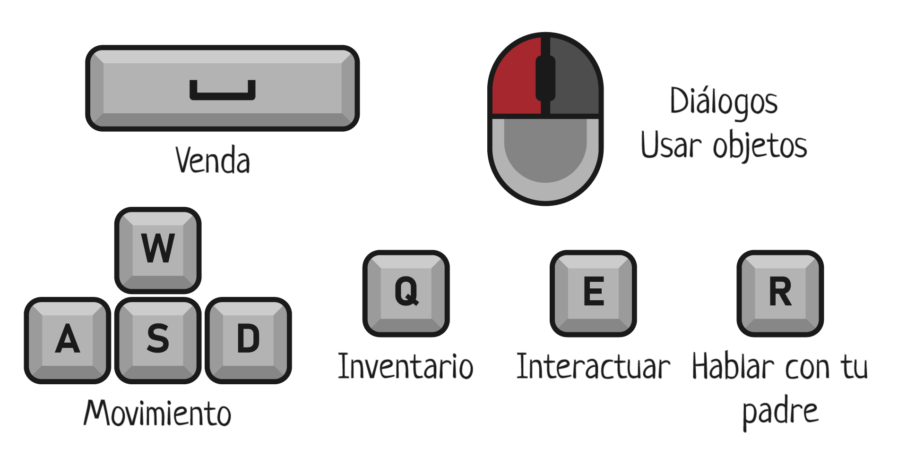

### Menús

El juego ofrece tres menús al jugador: uno **principal** otro de **pausa** y un último de **opciones/controles**.

- El **menú principal** se muestra al iniciar el juego y desde él se puede inciar la partidad desde el principio, seleccionar el nivel desde el que empezar o entrar al menú de opciones.
- El **menú de pausa** se accede durante la partida y es similar al menú principal, incluyendo una opción para volver a este o para reanudar la partida.
- El **menú de opciones** es accesible mediante los dos anteriores y además de resumir los controles del juego permite reducir o aumentar el volumen de los sonidos y música del mismo.

### Interfaz

El juego ofrece varios indicadores de interfaz:

- La **barra de cordura** indica la cantidad de cordura y se muestra siempre en pantalla.
- La **barra de fe** indica la cantidad de fe y solo se muestra cuando este valor recibe cambios.
- Los **tooltips** se muestran al lado de los items y de los npcs y sirven de feedback al jugador.
- Los **controles** se muestran siempre en la esquina superior derecha.
- El **inventario** muestra los objetos que el jugador a recolectado durante la partida y solo se muestra al presionar la Q.

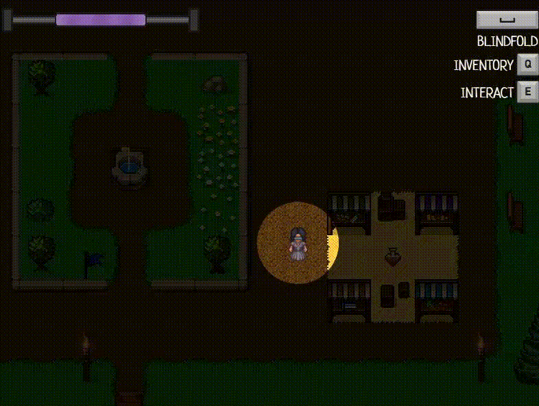

- *La venda, Miguel de Unamuno, 1899. (Temática principal)*
- *Zelda: Link's Awakening (mundo)*
- *Stardew Valley (mapa en cuanto a distribución y apariencia)*
- *Perception (Mecánica de visión)*
- *Lego Games (Fe)*
- *La Voluntad – Azorín (Barra de Cordura)*
