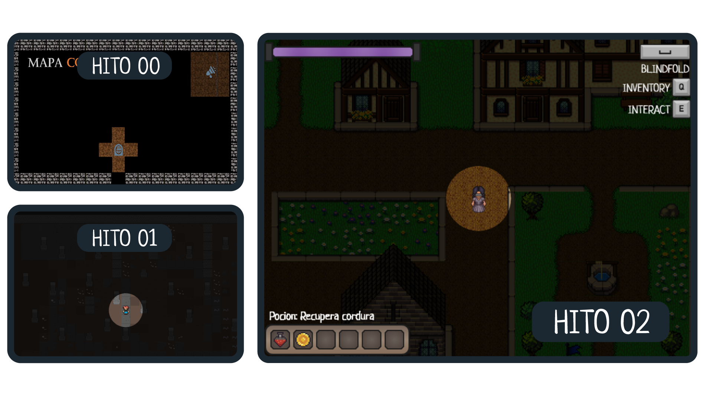
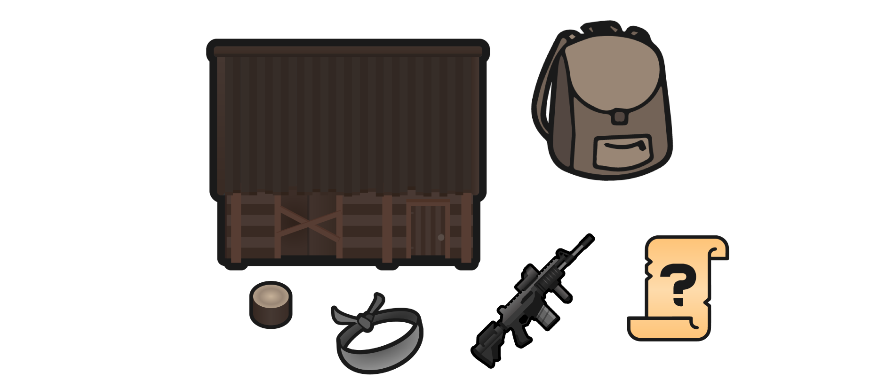
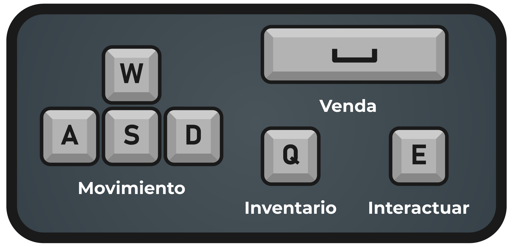
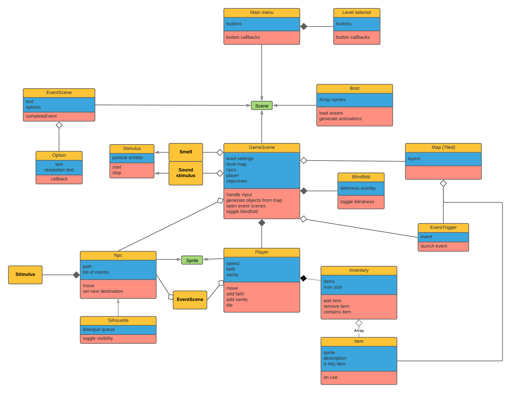
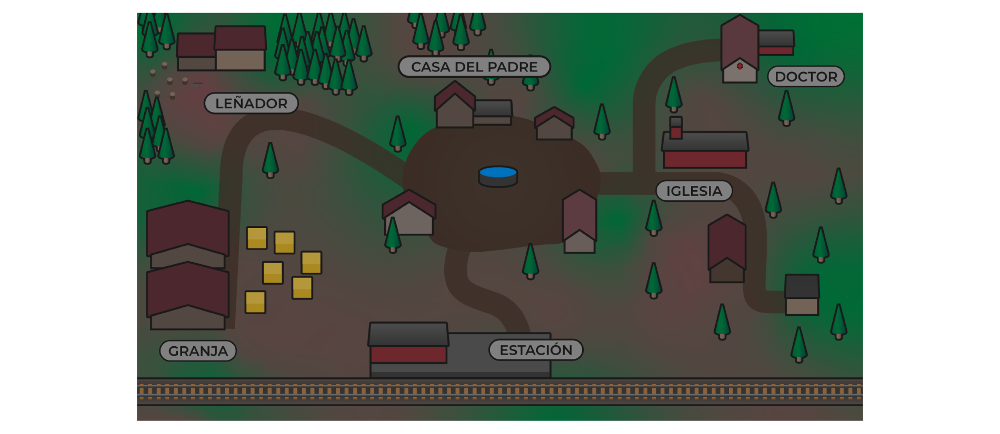

**Emiliagos Aarabels (EAa) [2º GDV]**

- Emile de Kadt ([edekadt@ucm.es](mailto:edekadt@ucm.es))
- Aarón Nauzet Moreno Sosa ([aarmor01@ucm.es](mailto:aarmor01@ucm.es))
- Abel Moro Paje ([abelmoro@ucm.es](mailto:abelmoro@ucm.es))
- Iago Quintas Diz ([iquintas@ucm.es](mailto:iquintas@ucm.es))

[ENLACE A PIVOTAL](https://www.pivotaltracker.com/n/projects/2467983)

_**Veiled**_ es un juego de exploración y mazmorras en perspectiva isométrica, en el que el jugador controla a una protagonista en su búsqueda por alcanzar la iluminación definitiva.

Esta protagonista lleva asiduamente una venda, ya que, tras recuperarse de su ceguera, sufrió una serie de acontecimientos perturbadores, lo que le llevaron a repudiar el mundo físico visible. Esto le motiva a avanzar en su búsqueda, para poder obtener la paz interna. Para ello, deberá cumplir una serie de objetivos a modo de eventos (de texto o físicos) que le permitirán avanzar tanto en el propio mapa, como a los distintos niveles, hasta alcanzar el final.

**Ventana de juego** (Placeholder)

### Movimiento

La protagonista se moverá en **8 direcciones** , siendo la velocidad de movimiento de aproximadamente de 3 casillas por segundo.

### Barra de cordura

El personaje tendrá un medidor que representa su **cordura**. Funcionará a modo de barra de vida, pues al agotarse toda la barra, el jugador se verá obligado a hacer un evento, tras el cual podrá, o bien recuperar un poco de cordura y continuar, o bien tener que reiniciar desde el último punto de guardado (iglesia).

A lo largo de la partida, la cantidad de cordura especifica tendrá una serie de efectos en el jugador, como comenzar a percibir alucinaciones visuales y sonoras (que irán empeorando cuanto menor sea la cordura), además de pequeños impedimentos sensoriales, con el fin de recordarle que no puede mantenerse todo el rato sin venda.

El progreso de la barra sigue una escala logarítmica tanto en positivo como en negativo, tal que cuando está baja las pérdidas son reducidas y cuando esté alta los incrementos son reducidos.

### Percepción

#### Venda

El jugador tendrá puesta constantemente una **venda** , que le impide ver el mapa salvo un radio de 1 casilla alrededor del personaje (el rango de sonido de sus pasos). Aun así, es posible quitarse la venda, lo que permitirá ver mayor parte del mapa y percibir colores, pero hará que disminuya la barra de cordura hasta que vuelva a ponérsela (y no incrementa al volver a ponérsela).

Con respecto a la alteración de la visión en base a la cordura, a menos de 60% de cordura, el rango de detección de estímulos no visuales (sonidos) se limitará estrictamente al radio de detección. Por encima de este nivel, el radio define el límite de detección clara, con un efecto de difumado a todo lo que haya más allá de este punto. Este cambio tiene que ocurrir lo suficientemente rápido para ser visible.

A menos de 35% de cordura, todos estos mismos objetos se seguirán detectando, pero no se podrán identificar a simple vista en pantalla; se indicará que hay algo sin especificar el qué.

Cuando la cordura esté por debajo del 10%, no se podrá interactuar con las memorias. Se seguirá viendo en pantalla las localizaciones de estas, pero todavía sin mostrar detalle.

#### Estímulos

A lo largo del mapa, habrá una serie de **estímulos sensoriales** (sonido, olfato) que permitirán al jugador esclarecer el contorno de ciertas zonas del mapa. Estos estímulos aparecerán cada cierto tiempo. ¿Sobrecarga de sentidos?

### Fe

La **fe** sirve como principal medidor de progreso del juego. Además, en cada nivel habrá un medidor de fe conseguida a lo largo del mismo (estilo barra True Jedi del Lego Star Wars)

Después de cada nivel, se indica la fe obtenida y cuantas "misiones" has hecho en la pantalla de nivel completado.

Además, según tu nivel de fe obtenida, algunos eventos en los niveles siguientes tendrán nuevas opciones (acortar el evento principal, pero obteniendo la misma fe, por ejemplo).

### Eventos

En el mapa, habrá esparcidos una serie de **eventos de texto** (por interactuar con un objeto, con una silueta, o aleatoriamente) que permitirán responder desde con 2 a 4 opciones. Hay distintos tipos:

- **Eventos localizados:** Se encuentran en un punto concreto del mapa, se lanzan mediante interacción o posición.
  - Principales (Siluetas): Algunos eventos serán provocados por _siluetas_, eventos de aspecto difuso que solo son visibles con la venda puesta y teniendo encima de un cierto umbral de cordura. Estas siluetas representan memorias del pasado de la protagonista, suponiendo el objetivo principal de cada nivel. Este objetivo concluirá en un gran incremento de fe y desbloquea el siguiente nivel.
  - Secundarios: sirven para expandir la historia, obtener recompensas (cordura, fe, consumibles)

- **Eventos no localizados:** se lanzan en cualquier punto del mapa sin necesidad de interacción.

  - Trigger: se lanzan al cumplir ciertos objetivos, por ejemplo, alcanzar un _threshold_ de cordura.
  - Informativo: se lanzan para informar al jugador ya sea de un aspecto jugable (tutoriales, consejos, etc) o de historia.

Así, cada uno tiene un indicador de que tipo es: de avanzar en la historia, de desafío, para conseguir un objeto.... Además, algunas de estas opciones pueden tener requisitos para ser respondidas, como tener un objeto clave o tener cierto nivel de cordura.

### Objetos

A lo largo de la partida se podrán conseguir **objetos** , que afecten a las características del jugador (número de casillas visibles, cantidad de cordura...). Estos se podrán obtener siendo encontrados en el mapa o bien como recompensa tras un evento. Cada uno tendrá una descripción que indicará que hace cada uno. Se dividen en:

- **Claves** : Necesarios para avanzar en uno de los posibles eventos y llegar al siguiente nivel. (Ejemplo: Hacha que permite talar el árbol para llegar a la siguiente zona).
- **Consumibles** : De un solo uso, permiten recuperar cordura o tener efectos beneficiosos temporales. (Ejemplo: Caleidoscopio que disminuye el gasto de cordura con la venda quitada). También pueden lanzar eventos secundarios.

### Iglesia

La **iglesia** es un punto del mapa que tiene asociado un evento que puede recuperar una parte variable de la cordura dependiendo de la fe (podrá &quot;rezar&quot; cada vez que su fe suba hasta 25%, por ejemplo). Además, servirá como punto de reaparición para el jugador en caso de que falle el evento de quedarse sin barra de cordura.

**Nivel 1** --> Templo; **Nivel 2** --> Altar en la costa del puerto; **Nivel 3** --> Catedral.

Si el jugador ha completado todos los objetivos secundarios del nivel, rezar en la iglesia le subirá hasta un nivel de cordura algo por encima del mínimo requerido para emprender el objetivo principal (indicado por un evento). Esto es para que no se pueda quedar bloqueada la partida si, tras completar todos los objetivos secundarios, se quita la venda demasiado y su cordura baja por debajo del nivel requerido para progresar, ya que podría no haber más fuentes de cordura en el nivel.

### Objetivo y conflictos

El **objetivo** del juego es ir ayudando a cada silueta que hay en cada nivel, para así poder ir avanzando en los distintos niveles y llegar a alcanzar la iluminación

Explorar con la venda puesta será más difícil, pero no drenará la cordura. Algunos objetos o pistas serán imposibles de encontrar con la venda puesta. Sin embargo, explorar sin la venda será mucho más rápido y eficiente, pero más arriesgado, ya que perderás cordura.

Conforme se llena y vacía la barra de cordura, los cambios en la visión están destinados a que el jugador no comience ningún objetivo nuevo cuando esté muy bajo de cordura, y se centre en restaurarla.

A lo largo del nivel la barra fluctúa bastante a lo largo de una jugada completa. La principal forma de obtener este efecto es una escala logarítmica que gobierna los cambios de nivel de la barra, de tal forma que cuando esté casi llena, la progresión se hace muy lenta, y cuando esté baja, se hace más rápida. Esto tiene dos consecuencias principales: comenzar el objetivo principal del nivel requiere tener la venda puesta durante un tiempo (para no perder cordura); y, aunque haya un nivel bajo de cordura, no implica una partida perdida, pues la escala permitirá recuperar cordura rápidamente.

### Comportamiento esperado

La búsqueda de pistas y objetos que te ayuden implica más exploración, la cual puede ser realizada con o sin venda.

Cuando el jugador entre en un nivel, primero empezará a explorar un poco, probablemente encontrando y completando por el camino algún objetivo secundario. En algún momento encontrará la silueta del nivel, y ocurrirá una de dos cosas: o el jugador tendrá suficiente cordura para emprender el objetivo, en cual caso lo hará, o no la tendrá en cual caso se acordará de la posición de la silueta mientras vuelve a buscar incrementos de cordura.

Cuando complete el objetivo principal, el jugador puede quedarse por el nivel, completando algún objetivo secundario que quiera o necesite (si encuentra y completa muy rápido el objetivo principal, es posible que no tenga suficiente fe para progresar al siguiente nivel). Para proceder al siguiente nivel, habrá que volver al punto de comienzo con la cantidad de fe requerida.

El juego tiene una dificultad baja y una longitud relativamente corta. Se espera que cualquier jugador pueda completar el juego en menos de 2 horas (?).

### Niveles

En un principio, el juego estará divido en **tres niveles principales** , además del **preludio** y el **nivel final** :

- Preludio: El jugador se encuentra en la habitación del padre, ya en su lecho de muerte. Ahí, será guiado por una serie de instrucciones para que se adapte a los controles mientras avanza una "pequeña" historia con el padre antes de morir.
- Pueblo: El jugador continuara explorando su pueblo natal interactuando con personajes de su infancia. El nivel estará compuesto por una zona residencial y algunos edificios clave como la casa del doctor o la estación de tren.
- Ciudad (Puerto): El jugador regresa a su casa en la zona portuaria de la ciudad y después de confrontar a su marido, el jugador tendrá que explorar zonas alrededor de su casa completando misiones. El nivel estará centrado en el puerto, una zona más pobre de la ciudad donde la mayoría de los habitantes viven de y para la industria generada por el mismo.
- Ciudad (Centro): María se adentra en el centro de la ciudad originalmente en busca de alguien que pueda enseñarle a leer sin enfrentarse a la vergüenza de aprender con alguien conocido. El monumento central de este mapa es la iglesia.
- Nivel Final: Tras un pequeño salto temporal, María llega a la catedral, donde el obispo le cuenta la reciente muerte de su hija. Tras hacer un paralelismo con su situación, se lee la carta de su padre. A mitad de la carta, llena de dolor, sale corriendo de la catedral, corriendo por un pasillo en el que se tiene que enfrentar a los susurros con los que ha hablado, hasta llegar al final del pasillo y encontrar la iluminación.

### Historia

María busca recuperar su fe en la misericordia de Dios, y en el proceso aprenderá a aceptar su nuevo don y a ver la belleza del mundo por un nuevo medio.

Comenzará en su pueblo natal, justo al presenciar la muerte de su padre. A lo largo del juego, se adentrará en lugares progresivamente más desconocidos para ella, a la par que coge más confianza con su vista, permitiendo que su cordura se drene más lento mientras tenga la venda quitada. Al final de cada capítulo, se enfrentará a una silueta, una memoria de aspecto indefinido, de su pasado cegado. La silueta le guiará a través de una serie de eventos que le llevarán a una revelación personal.

Al final del juego habrá un último paso hacia la iluminación en la que debe pasar por un «camino de lamentos» con la venda quitada todo el tiempo.

### Eventos

### Items

- **CLAVE**

| Nombre | Efecto | Descripción |
|--------|--------|-------------|
| Llave | Abre una puerta | N/A |
| N/A | N/A  | N/A |
| N/A | N/A  | N/A |

- **CONSUMIBLES**

| Nombre | Efecto | Descripción |
|--------|--------|-------------|
| Caleidoscopio | :heavy_minus_sign: Consumo de cordura con la visión activada | N/A |
| Venda de neopreno | Recupera cordura | N/A |
| N/A | :heavy_plus_sign: velocidad :heavy_plus_sign: consumo de cordura | N/A |
| Trompetilla | :heavy_plus_sign: radio de visión con venda | N/A |
| N/A | Objeto genérico que ayuda a resolver un evento secundario  | N/A |
| N/A | Permite hablar con una silueta cuando la cordura esta baja | N/A |
| Estampa de Unamuno | :heavy_plus_sign: Fe | N/A |
| Palabra ofensiva en braile | :heavy_minus_sign: Cordura | N/A |
| N/A | :heavy_plus_sign: Cordura/ RNG / :heavy_minus_sign: Cordura  | N/A |
| Cuerda Huida | Tp al centro del mapa   | N/A |
| N/A | N/A  | N/A |

El juego usa una estética difusa y minimalista, con gráficos de vectores, perspectiva ortogonal y una paleta apagada.

La mayor parte del arte estará creado por nosotros en la versión final.

[Ejemplo de efecto de sonido para cuando se baja un nivel de visión](https://www.storyblocks.com/audio/stock/big-object-falling-hit-hxbni32udhk0wxsh7x.html)

[Ejemplo de efecto de sonido para cuando se sube un nivel de visión](https://www.storyblocks.com/audio/stock/chime-harmony-hexslt328dsk0wxut4d.html)

Para jugar solo se necesitará el **teclado** , siendo el movimiento controlado con las teclas WASD, el uso de la venda será controlado con Espacio, la E servirá para interactuar con los elementos del entorno, Q para abrir el inventario (en los eventos y los menús hay diferentes posibilidades: si es fácil hacer soporte para el ratón, eso; si no, W y S se usarán para navegar y Espacio para seleccionar).

### Menús

El juego ofrecerá dos menús al jugador: uno **principal** y otro de **pausa/opciones** durante el juego.

- El **menú principal** se mostrará al iniciar el juego y contendrá opciones para modificar el volumen, consultar los controles, seleccionar un nivel previamente jugado o iniciar una nueva partida.
- El **menú de pausa** se podrá acceder durante la partida y contará con opciones similares al menú principal, incluyendo una opción para volver a este o para reanudar la partida.

### Interfaz

La interfaz en la pantalla de juego es muy minimalista compuesta solo de la barra de ¿CORDURA?, contador de fe, pequeños _tooltips_ al acercarse a ciertos objetos con los que el jugador puede interactuar y un pequeño icono para acceder al inventario, ¿una bolsa o una riñonera/bolsa de mano?

Además de la interfaz principal contara con un overlay simple de inventario donde se mostrarán lo objetos ¿notas? ¿pistas? ¿historial de eventos?

¿Otro icono desde el cual abrir un historial de eventos como un historial de diálogo de un RPG?

### Arquitectura

[Modelo](https://docs.google.com/drawings/d/1-1DPUHdG_3wb9gtGyfiG3ykvNLVxsPCKqEqCn9Yzmto/edit?userstoinvite=edekadt@ucm.es&amp;ts=5f92fe7b&amp;actionButton=1)

### Esquema de un nivel

### Relación Fe-Cordura

Cordura baja menos si Fe alta. Así el jugador es capaz de usar la venda con más frecuencia según avanza el juego.

| | Principal | Eventos | Nivel |
|--------|--------|--------|-------------|
| **Recompensa** | Fe (~80 % del requisito del nivel) | Cordura (+ pequeña cant. Fe) | N/A |
| **Requisitos** | Cordura alta  | Nada (salvo excepciones) | 100% Fe del nivel |

- *La venda, Miguel de Unamuno, 1899. (Temática principal)*
- *Zelda: Link's Awakening (mundo)*
- *Into the Breach (mapa en cuanto a apariencia)*
- *Dark Souls (Iglesia)*
- *Stardew Valley (mapa en cuanto a distribución)*
- *Perception (Mecánica de visión)*
- *Lego Games (Fe)*
- *La Voluntad – Azorín (Barra de Cordura)*
